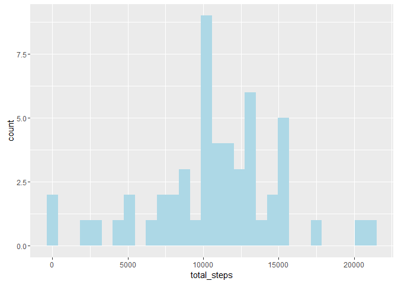
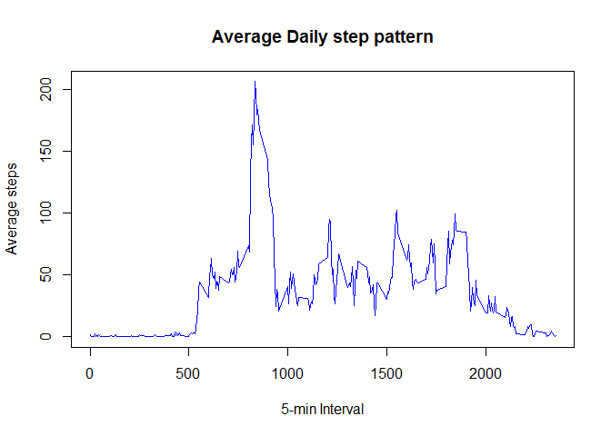
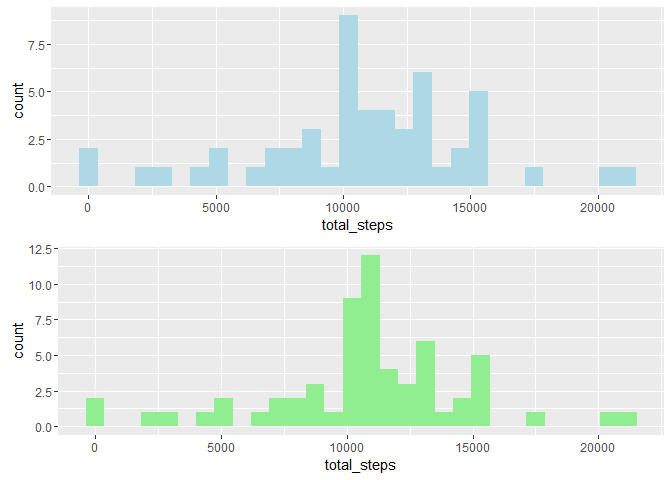
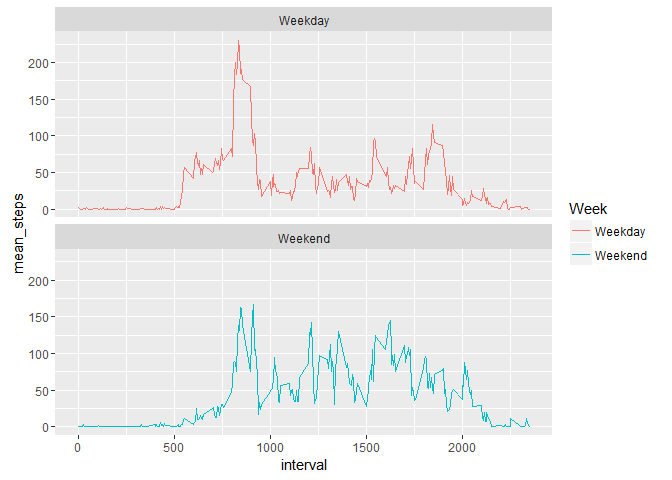

# Reproducible Research: Peer Assessment 1


## Loading and preprocessing the data

```r
# load required packages
library(plyr)
library(dplyr)
```

```
## 
## Attaching package: 'dplyr'
```

```
## The following objects are masked from 'package:plyr':
## 
##     arrange, count, desc, failwith, id, mutate, rename, summarise,
##     summarize
```

```
## The following objects are masked from 'package:stats':
## 
##     filter, lag
```

```
## The following objects are masked from 'package:base':
## 
##     intersect, setdiff, setequal, union
```

```r
library(ggplot2)
library(reshape2)
library(gridExtra)
```

```
## 
## Attaching package: 'gridExtra'
```

```
## The following object is masked from 'package:dplyr':
## 
##     combine
```

```r
## load data
dat<- read.csv("activity.csv", stringsAsFactors = FALSE)

# change date to Date format use as.Date function
dat$date<- as.Date(dat$date, format = "%Y-%m-%d") 

# add variable Day usingweekdays function
dat$Day<- as.factor(weekdays(dat$date, abbreviate = TRUE))

# add variable Week to group week days in "Weekday", & week ends in a "Weekend" categories
dat$Week<- as.factor(ifelse(dat$Day=="Sat"|dat$Day=="Sun", "Weekend", "Weekday"))

# read first 6 lines of the dataframe using head function
head(dat)
```

```
##   steps       date interval Day    Week
## 1    NA 2012-10-01        0 Mon Weekday
## 2    NA 2012-10-01        5 Mon Weekday
## 3    NA 2012-10-01       10 Mon Weekday
## 4    NA 2012-10-01       15 Mon Weekday
## 5    NA 2012-10-01       20 Mon Weekday
## 6    NA 2012-10-01       25 Mon Weekday
```

```r
# get structure of the dataset using str function
str(dat)
```

```
## 'data.frame':	17568 obs. of  5 variables:
##  $ steps   : int  NA NA NA NA NA NA NA NA NA NA ...
##  $ date    : Date, format: "2012-10-01" "2012-10-01" ...
##  $ interval: int  0 5 10 15 20 25 30 35 40 45 ...
##  $ Day     : Factor w/ 7 levels "Fri","Mon","Sat",..: 2 2 2 2 2 2 2 2 2 2 ...
##  $ Week    : Factor w/ 2 levels "Weekday","Weekend": 1 1 1 1 1 1 1 1 1 1 ...
```

## What is mean total number of steps taken per day?

```r
# Create dataset for total steps taken per day
dat2<- dat %>% 
        filter(!is.na(steps)) %>%
        group_by(date) %>%
        summarise(total_steps=sum(steps, na.rm = TRUE))
# Calculate mean and median for steps taken per day
dat2 %>% summarise(Mean_steps=mean(total_steps),Median_steps=median(total_steps))
```

```
## Source: local data frame [1 x 2]
## 
##   Mean_steps Median_steps
##        (dbl)        (int)
## 1   10766.19        10765
```

## Histogram of steps taken per day

```r
# plot histogram for steps taken per day
ggplot(data=dat2, aes(total_steps)) + geom_histogram(fill="light blue")
```




## What is the average daily activity pattern?

```r
# Create dataset for total steps taken per interval across days
dat3<- dat %>% 
        filter(!is.na(steps)) %>%
        group_by(interval) %>%
        summarise(total_steps=mean(steps, na.rm = TRUE))

# Plot average number of steps per interval across all days
plot(x=dat3$interval, y=dat3$total_steps, type = "l", col="blue",main = "Average Daily step pattern", ylab = "Average steps", xlab="5-min Interval")
```



```r
# Interval with maximum number of steps
dat3[which.max(dat3$total_steps),]
```

```
## Source: local data frame [1 x 2]
## 
##   interval total_steps
##      (int)       (dbl)
## 1      835    206.1698
```


## Impute missing steps: Strategy is to use the mean of intervals to impute missing steps

```r
# Total missing step data
sum(is.na(dat$steps))
```

```
## [1] 2304
```

```r
# % of missing data
mean(is.na(dat$steps))
```

```
## [1] 0.1311475
```

```r
# get a dataframe with missing step data
missing_steps<- dat[is.na(dat$steps),]

# drop levels
missing_steps<-droplevels(missing_steps)

# use split and sapply to find number of rows that have missing step data for weekdays and weekends
sapply(split(missing_steps, missing_steps$Week), nrow)
```

```
## Weekday Weekend 
##    1728     576
```

```r
# save the missing data in a vector
missing<- which(is.na(dat$steps))

# rename data set
dat_impute<- dat

# impute 
interval_steps<- tapply(dat$steps, dat$interval, mean, na.rm=TRUE)
#str(interval_steps)
dat_impute$steps[missing]<- interval_steps[as.character(dat_impute$interval[missing])]

# get total of missing data after imputation
sum(is.na(dat_impute$steps))
```

```
## [1] 0
```

## Create dataset for total steps taken per day

```r
# create dataframe containing total steps taken per day
dat_impute2<-dat_impute %>% 
        #filter(!is.na(steps)) %>%
        group_by(date) %>%
        summarise(total_steps=sum(steps, na.rm = TRUE))
```

## Compare Histogram of the original data and imputed data

```r
# original data
p1<-ggplot(data=dat2, aes(total_steps)) + geom_histogram(fill="light blue")
p2<- ggplot(data=dat_impute2, aes(total_steps)) + geom_histogram(fill="light green")
grid.arrange(p1,p2, nrow=2)
```



## Calculate mean and median for steps taken per day

```r
dat_impute2 %>% summarise(Mean_steps=mean(total_steps),Median_steps=median(total_steps))
```

```
## Source: local data frame [1 x 2]
## 
##   Mean_steps Median_steps
##        (dbl)        (dbl)
## 1   10766.19     10766.19
```


## Are there differences in activity patterns between weekdays and weekends?

```r
dat4<-dat_impute %>% 
        #filter(!is.na(steps)) %>%
        group_by(Week, interval) %>%
        summarise(mean_steps=mean(steps, na.rm = TRUE))
ggplot(data = dat4, aes(x=interval, y=mean_steps, col=Week)) + geom_line() + facet_wrap(~Week, nrow = 2)
```



## Conclusion
Based on the Weekday vs Weekend comparison graphs, it is cear that the daily activity is higher earlier in the day during the weekdays but higher for the rest of the day during the weekends.
